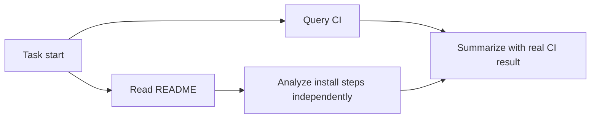

## 5. Async tool calling: writing one `async def` does not mean you have it

### 5.1 Four kinds of "async" that are easy to confuse

| Type | Who keeps working | Can the model advance while a result is missing? |
|---|---|---|
| HTTP async client | The application thread is not blocked | Not necessarily; the model may still wait for the tool result |
| Multi-tool parallel execution | Multiple tools run simultaneously | Not necessarily; the model may wait for all results |
| Background response | The user does not need to hold a sync request | The response task is in the background; this does not let you infer tool-dependency semantics |
| Model protocol-level async tool | While the tool is pending, the model continues independent reasoning/calls | Yes, but you cannot assume the missing result |

The current API expresses the last case via `async: true` on function or custom tools; the tool is still executed on the application side, and the result is returned with the original `call_id`. It differs from Background mode, and the current docs do not allow using such async tools in PTC; multi-agent mode has additional composition restrictions. [Async tool calling](https://developers.openai.com/api/docs/guides/async-tool-calling)

### 5.2 A concrete example

Task: "Query the CI result and check whether the README documents the install steps."

```text
Basic serial: query CI 40s → read README 5s → summarize 2s
Parallel tools: CI and README start at the same time → wait for both → summarize
Non-blocking agent: start CI first → read README and analyze install steps → CI returns → merge conclusions
```

While CI is pending, the model can point out the README's gaps, but cannot say "CI has passed." The correct dependency graph is:



### 5.3 Why might it be faster?

Assume the model's independent work takes `M`, tools take `T`, and coordination overhead is `O`:

```text
Serial: M + T
Ideal overlap: max(M, T) + O
Theoretical saving: min(M, T) - O
```

This is only a latency model. If the next step must know the tool result, you still wait; if all tools contend for the same database lock, so-called parallelism will not speed things up noticeably. Measure critical path, p50/p95, and failure rate, not just "how many asyncs were called."

### 5.4 What must the harness fill in?

A minimal pending registry needs to record:

```text
key = (thread_id, turn_id, call_id)
value = {
  tool_name, arguments_signature, created_revision,
  task_handle, timeout, status, result, delivered
}
```

State transitions can be designed like this:

```text
created → queued → running → completed / failed / cancelled
                               ↓
                       result persisted → delivered
```

You also need to handle: tool failures returning structured errors; duplicate submissions not re-executing; the same ID with different arguments being rejected; concurrency limits; whether the timeout includes queue time or only execution; late results not being misused for a new requirement; and cancellation propagating to the real executor.

### 5.5 Why launch tools from the stream as early as possible?

If the application waits for `responses.create()` to receive the full response before launching tools, the model may already have generated an independent answer, and I/O and generation will not have overlapped much in practice.

A streaming implementation should launch a task **once the complete tool-call item has been generated**, not from an incomplete JSON argument fragment. In the appendix, `live_api.py async` registers a worker on `response.output_item.done` and posts the result back after the stream ends. It is a real API wiring example, but this run did not call a paid model.

```json
{
  "type": "function",
  "name": "scan",
  "async": true,
  "parameters": {
    "type": "object",
    "properties": {"module": {"type": "string"}},
    "required": ["module"],
    "additionalProperties": false
  }
}
```

Keep the original `call_id` when returning the result, and attach it to the latest response chain so you do not drop conversation added while the tool was running.

### 5.6 The relationship between wait and yield

You can have a tool first return an awaitable task identifier, let the model continue working, and wait only when it truly depends on the result. This mechanism can be implemented at the application layer and does not necessarily require the API's async flag.

But `job_handle` and the API `call_id` are not the same thing: the former may be a name in your business registry; the latter is the identifier the protocol uses to match results. Do not treat a model-defined handle as a low-level ID the model already knows.

The Codex Code Mode source shows the paths for launching a cell, initial output, keeping the cell alive after yield, and subsequent wait/terminate handling. This proves that non-blocking execution needs full lifecycle management, not just a tool-declaration change. [execute handler](https://github.com/openai/codex/blob/ddea03ad049142943bdbf13e937b1d67e8c1ba0c/codex-rs/core/src/tools/code_mode/execute_handler.rs), [wait handler](https://github.com/openai/codex/blob/ddea03ad049142943bdbf13e937b1d67e8c1ba0c/codex-rs/core/src/tools/code_mode/wait_handler.rs)

### 5.7 What does the local demo verify?

`runtime_demo.py` launches two simulated tools at the same time, records independent work before they finish, and handles one user change. The tests do not use a flaky timing threshold to judge parallelism; instead they verify that **the start event of the second tool appears before the completion event of the first**.

It does not call an LLM, so what it proves is Python's scheduling and state-management mechanism, not Astra inference capability. The output of about 0.123s in this run is just simulated wait time, and cannot be written up as "Codex performance improved by xx%."

<a id="steering"></a>
## 6. Mid-turn steering: how to stay consistent when requirements change mid-run

### 6.1 Why is a basic harness bad at this?

A basic loop typically only reads the next user input "after a turn ends." The user wants to say "do not commit, only analyze," but the model still follows the original plan. Simply cancel-and-restart also has costs: losing intermediate state, repeating tools, and being unable to precisely judge whether an external action has already happened.

The goal of steering is to preserve completed work and attach the new requirement to the running task.

### 6.2 Two layers of steering — do not mix them

| Layer | Interface | Target |
|---|---|---|
| Codex App Server | `turn/steer` | The active turn of a specific thread |
| Responses API | WebSocket `response.steer` | The target response on the same connection |

The App Server's protocol tests include behavioral checks such as turn ID; its client interface and the Responses API's model-service interface do not share a schema. You cannot casually send a `turn/steer` field to a regular HTTP `/responses`. [App Server steering tests](https://github.com/openai/codex/blob/ddea03ad049142943bdbf13e937b1d67e8c1ba0c/codex-rs/app-server/tests/suite/v2/turn_steer.rs)

App Server example:

```json
{
  "id": 20,
  "method": "turn/steer",
  "params": {
    "threadId": "实际threadId",
    "expectedTurnId": "实际活动turnId",
    "input": [{"type": "text", "text": "改成只读分析，不执行文件修改。"}]
  }
}
```

`expectedTurnId` acts like a misdelivery check: the turn the client believes is still running may already be finished, and the server must not silently apply the update to the next turn.

### 6.3 Where the Responses API takes effect

The current official guide says Astra supports WebSocket steering. After the request is accepted, it does not modify output already emitted, nor does it undo actions already executed. It stitches into a successor response at an appropriate boundary; **the successor's `response.created` is the commit point for the update**. When it depends on application tool results or approvals, it goes pending. [Steering guide](https://developers.openai.com/api/docs/guides/steering)

```text
response.created(parent)
    ↓ user sends response.steer
response.steer.accepted                 queued
    ↓ end current output boundary / wait for required input
response.incomplete(reason=steered)     may appear; parent may also complete normally
    ↓
response.created(successor)             update committed to the successor response
    ↓
response.completed(successor)           successor response completes
```

When there are client-owned tools or an approval is pending:

```text
accepted → parent completed → steer.pending(required_input)
           → fill required_input with saved tool results
           → submit one continuation for the same parent
           → successor created
```

**Do not resend steering content that has already been accepted, and do not re-run side-effectful tools just to fill required_input.** A disconnect also does not mean the request was not accepted. Precise restrictions also include: only supported user inputs are allowed; the current reference does not support binding to a conversation or combining with automatic compaction. [Responses WebSocket event definitions](https://developers.openai.com/api/reference/cli/resources/beta/subresources/responses)

### 6.4 "Change while generating" is not the same as rewriting already-sampled tokens

The interview answer should be: the server incorporates the new input into subsequent continuation, taking effect at the safety boundary the protocol promises. You cannot infer from interaction behavior that it modifies the KV cache, current neural-network activations, or already-generated tokens in place.

### 6.5 What about writes already sent?

Suppose the old plan was "modify config and publish" and the new requirement is "read-only analysis." A reasonable design is:

1. On receiving a new requirement, increment the business revision.
2. Undispatched change plans are invalidated and reassessed.
3. Read-only tools already running may keep results, but check the scope of applicability.
4. Uncommitted writes must recheck revision and permissions before execution.
5. Completed external writes can only be handled by compensation or rollback; they cannot be claimed as "undone by steering."

The appendix Runtime's `commit()` checks the revision; tests prove that an old plan with revision 0 cannot be committed after revision 1. It only records a teaching proposal and does not operate any real external system.

Real database writes should place version check and write inside the same transaction/CAS boundary; remote calls should use idempotency keys and reconciliation. "Check then call HTTP" inside the application still has a race window.

### 6.6 Interview answer

> The hard part of mid-turn steering is not just receiving a new message, but defining the input's acceptance point, effect point, and the boundary of already-completed side effects. I use active-turn checks, requirement revisions, and pre-execution authorization checks, keep completed tool results, and reconcile after a disconnect rather than blindly retrying.

<a id="ptc"></a>
