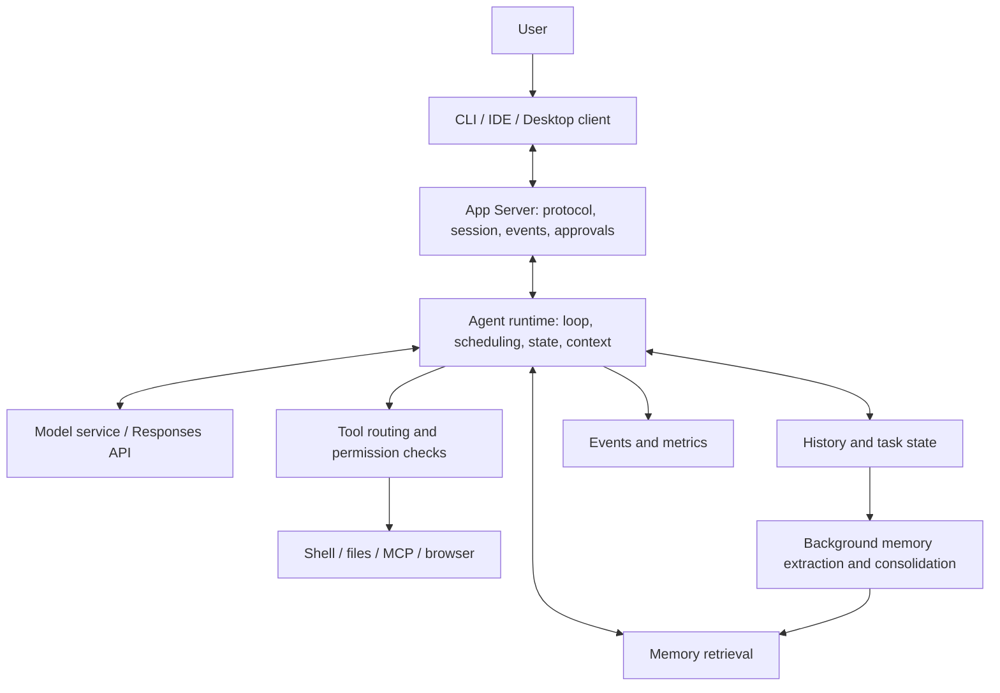

<Note>
This article separates product experience, public documentation, pinned source code, offline demos, and real API wiring.
Code samples are for teaching purposes and do not represent Codex's internal implementation.
</Note>

Verification date: 2026-09-10. Subject: user-provided social media screenshots from 2026-09-07.

**The technical thesis is: a coding agent's capability comes not only from the model, but also from the runtime that hosts the model, the tool execution protocol, context management, memory, and interaction systems. When these mechanisms match model training, an agent can complete long tasks more efficiently. This thesis is worth learning, but the vendor put-downs, absolute rankings, and originality claims in the screenshots cannot be used directly as interview conclusions.**

This article proceeds as: "what the quote means → public evidence → how it works → how to implement it → comparison with a baseline harness → interview follow-ups." The code is an original teaching implementation, not an attempt to impersonate Codex's internal code. Real API examples are called out separately. Keeping only this Markdown gives you the full tutorial and code.

## Reading guide

1. [Line-by-line screenshot check](/guides/codex-harness-overview#claims)
2. [Harness fundamentals and layering](/guides/codex-harness-overview#foundations)
3. [Unified Runtime Host and App Server](/guides/codex-harness-runtime#3-统一-runtime-host-与-app-server-到底先进在哪里？)
4. [Technical implementation of the Agent GUI](/guides/codex-harness-runtime#4-agent-gui：看上去是界面，本质上是运行时状态的投影)
5. [Async tool calls and reasoning while executing](/guides/codex-harness-async#5-异步工具调用：不是写一个-async-def-就实现了)
6. [Mid-turn steering](/guides/codex-harness-async#6-mid-turn-steering：运行中改需求，怎样保持一致性？)
7. [PTC, Code Mode, and MCP](/guides/codex-harness-code-mode#7-ptc-/-code-mode：为什么让模型写代码来调用工具？)
8. [Compaction, window switching, and history retrieval](/guides/codex-harness-context-memory#8-上下文管理：压缩、换窗口、检索不是一回事)
9. [Memory and dreaming](/guides/codex-harness-context-memory#9-memory-与-dreaming：agent-如何从过去的工作中积累经验？)
10. [How post-training pairs with the harness](/guides/codex-harness-computer-use#10-后训练如何与-harness-配合？哪些能讲，哪些不能编？)
11. [Computer Use](/guides/codex-harness-computer-use#11-computer-use：从“会点鼠标”到可靠的环境闭环)
12. [Benchmarks and causal attribution](/guides/codex-harness-evaluation#12-benchmark：为什么“成绩好”不能直接证明-harness-最强？)
13. [Fair comparison with traditional harnesses and Claude](/guides/codex-harness-evaluation#13-与传统-harness、claude-的公平对比)
14. [Interview delivery and common follow-ups](/guides/codex-harness-evaluation#14-面试表达：怎么把这些内容讲得具体而可信？)
15. [Hands-on runs and acceptance](/guides/codex-harness-run#15-动手运行：先验证机制，再接真实模型)
16. [Source code navigation and references](/guides/codex-harness-sources#16-公开资料与源码阅读顺序)
17. [Full code appendix](/guides/codex-harness-code#17-完整代码附录)

<a id="claims"></a>
## 1. Which claims in the screenshots can you take at face value?

"Verified" below only means that public materials or source code support the mechanism. It does not mean every account, platform, or version has it enabled, nor that it will necessarily do better on your task. The screenshots repeat the async tool calling claim, which this article merges into one explanation.

| Screenshot claim | Verification result | How to phrase it in an interview |
|---|---|---|
| Codex Desktop UI/UX defines the Agent GUI spec | Subjective judgment, no evidence of an industry-wide spec | You can analyze how its tasks, events, approvals, and diff review reduce interaction cost |
| V2 uses App Server as a unified runtime host | The App Server interface and shared-host direction have public backing; "V2" cannot be extended to a second-generation architecture for all products | A unified runtime contract lets different clients reuse task state and execution capabilities |
| The CLI can connect to an App Server someone else deployed | Official docs describe remote CLI usage | Client and execution host can be separated. Remote connection also involves auth, versioning, and workspace permissions |
| Claude Code uses one bun per session, so its architecture is behind | The evidence here is not enough to verify that internal-implementation summary. Language and process count alone do not prove architectural superiority | Compare fault isolation, resource reuse, state recovery, and lifecycle |
| Every harness benchmark is top of the pack | No benchmark version, date, model, or run configuration is given, so this cannot be confirmed as a whole | Scores belong to the model plus agent system combination. You cannot attribute them to the harness alone |
| Astra can call tools asynchronously and reason while executing | Currently supported explicitly in the official docs | `async: true` lets the model keep doing independent work before a tool returns. Execution and pending state are still managed by the application |
| The async capability comes from post-training | Product behavior is confirmed. You cannot recover training data, reward, or optimization algorithm from that | The model has to learn dependency identification, waiting, and handling late results. The training recipe has not been made public |
| Server-side context compaction, shorter windows but better results | The compaction mechanism is supported. "Better results" and "shorter window" need a specific model and experiment | Distinguish nominal window, effective working set, compaction quality, and task success rate |
| Responses API mid-turn steering | There is a formal description and event protocol today | Accepted, in effect, and completed are different states. It also does not undo actions that have already run |
| Computer Use is #1 in the world | This time we could not verify a single ranking that covers every task | Explain the perceive–act–feedback loop. Rankings must be bound to a specific benchmark |
| Context windows use sliding rather than compaction | The source code has both no-summary new windows and history retrieval, and it still has a compaction implementation | New windows, history retrieval, and compaction can coexist. You cannot say "Codex no longer uses compaction" |
| Memory is the most advanced, most seamless, and dreams | Background memory extraction and consolidation have public backing. "Most advanced" is a judgment call | "Dreaming" works as a metaphor for offline memory consolidation. It is not sleep consciousness and does not update model weights online |
| PTC / Code Mode paired with the model is stronger | Both mechanisms have docs or source. Actual lift needs experiments | Let code handle deterministic data processing and orchestration. Let the model handle semantic decisions |
| MCP is primitive, Plan Mode is a historical relic | Value judgments, not engineering facts | MCP handles connection and capability exchange. Plan Mode handles collaboration phases. Whether they help depends on the task |

Evidence entry points: [App Server](https://learn.chatgpt.com/docs/app-server), [Astra capability notes](https://developers.openai.com/api/docs/guides/latest-model?model=gpt-6-astra), [Memories](https://learn.chatgpt.com/docs/customization/memories). Specific implementation evidence is given near each chapter.

### 1.1 Three "Codex"es you must not confuse

- **Model**: for example `gpt-6-astra`, which generates text, tool requests, and other model output.
- **Agent runtime / harness**: receives model output, executes tools, keeps state, controls permissions, and handles failures.
- **Product client**: the desktop app, CLI, IDE, and so on, which surface tasks to the user and accept operations.

Saying "the product experience is good, therefore the model architecture is advanced," or "this API feature was invented by the desktop app," are both cross-layer attributions.

### 1.2 Evidence boundaries for this article

The public source is pinned to `openai/codex` commit **`ddea03ad049142943bdbf13e937b1d67e8c1ba0c`**, committed 2026-09-10 03:40:55 UTC. This is the main snapshot read for this article. **It is not necessarily the build commit of any locally installed binary.** The local verification environment is Codex CLI `0.153.4`, Python `3.14.7`, and Node.js `26.7.0`.

A handler, type, or test existing in the source only proves that code path exists. To decide whether it is enabled by default, actually routed, or available on your account, you still have to check feature gates, registration conditions, release notes, and run traces. Without an official backend, training logs, or a cross-platform internal deployment diagram, this article does not fill those details in.

<a id="foundations"></a>
## 2. First, understand what a harness is: it is not just wrapping a prompt

### 2.1 The most basic agent loop

Suppose a user says, "Fix the failing login test." The model cannot change the file system by itself. It emits requests like "read file" and "run tests." An external program executes them, hands results back, and the loop continues.

Below is **teaching pseudocode** that illustrates a basic serial harness. It is not any current vendor implementation:

```python
history = [user_request]
for step in range(max_steps):
    output = model.generate(history, tool_definitions)
    history.extend(output.items)
    if output.tool_calls:
        for call in output.tool_calls:
            validate_schema(call)
            authorize(call)
            result = execute(call)
            history.append(tool_result(call.id, result))
    else:
        return output.final_answer
raise BudgetExceeded()
```

This is enough to be an agent, but it does not reliably solve: users changing requirements mid-run, tests that take minutes, history exceeding the window, process crashes, tool timeouts, task reconnection, multi-client observation, permission revocation, cross-task memory, and so on.

### 2.2 An engineering-usable layering



This is the conceptual layering used in this article, not a one-to-one map of Codex's process deployment. The boundary between "runtime" and "harness" is not consistent across teams: some call every outer system the harness, others call the execution environment the runtime and reserve "harness" for the loop and policy layer. In an interview, agreeing on terms up front matters more than arguing over naming.

| Layer | What it does | What it should not own alone |
|---|---|---|
| Model | Understand goals, choose actions, handle semantics | Cannot replace tool evidence with "I already succeeded" |
| Harness | Turn model decisions into controlled state transitions | Should not treat tool-return text as top-priority instructions |
| Tool executor | Validate, authorize, execute, output | Does not decide whether the business is actually done |
| State store | Events, tasks, artifact references, recovery info | Should not keep only UI display text |
| Context management | Pick usable information for the next inference step | Not the same as a full history database |
| Client | Show progress, accept feedback, review results | Cannot show "task complete" based only on HTTP 200 |

### 2.3 Three kinds of state you must keep separate

```text
Conversation state: what the user said, what the model output
Execution state: which tools are running, who holds permission, which actions have been committed
Environment state: what disk files, database records, and browser pages currently look like
```

Rolling back the conversation is not rolling back files. Interrupting the model is not killing child processes. A history summary that says "tests passed" is not the same as tests passing against the latest code. Every mechanism that follows is built on top of these three distinctions.

<a id="app-server"></a>
