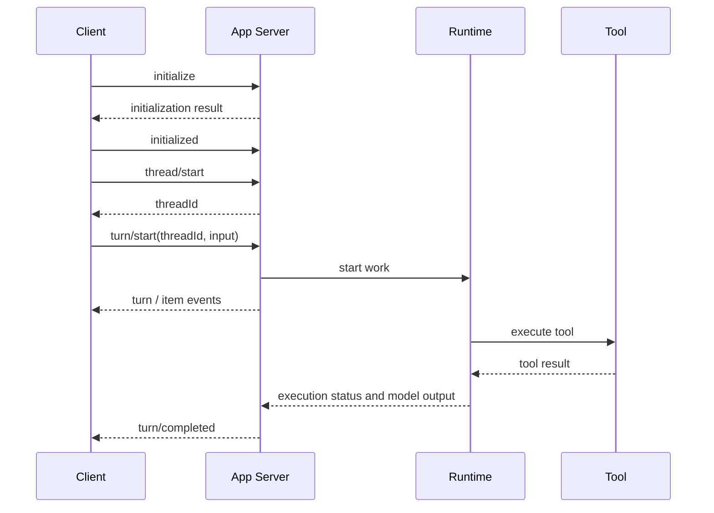

## 3. What is truly advanced about a unified runtime host and App Server?

### 3.1 The most valuable part of "unified across ends" is a unified contract

A basic design might have the CLI, IDE, and desktop each implement its own loop. When you add "continue after approval," every end needs a code change, and the state semantics easily diverge.

The idea of a shared runtime is: the client sends structured intent, the host owns the tasks and execution, and then pushes the event stream back to the client. The same tool start, tool end, awaiting approval, completed, and failed can be represented in a single set of state semantics.

App Server provides bidirectional communication and protocol primitives such as threads, turns, and items. The official description says it can be used for rich-client integration and supports the CLI connecting to a remote host. **This supports "a reusable host interface," but does not prove that all products run only one OS process, or that all threads share one JavaScript heap.** [Official App Server documentation](https://learn.chatgpt.com/docs/app-server)

```text
Thread: a continuous conversation
  └─ Turn: one user request plus the following round of work
       └─ Item: user message / model message / tool execution / file change / etc.
```

Note: different SDKs do not define "turn" identically. Do not conflate Codex's product turn, one model API response, and a single model step within the loop.

### 3.2 How does a request complete end to end?



Protocol messages follow JSON-RPC style, and App Server omits the `jsonrpc` field on the wire. Requests have an `id`; notifications do not; reverse approval requests also have an `id`. So you cannot write "treat the first line of JSON read as the current request's result."

```json
{"id":1,"method":"initialize","params":{"clientInfo":{"name":"interview_demo","version":"0.1.0"}}}
```

```json
{"method":"initialized","params":{}}
```

```json
{"id":2,"method":"thread/start","params":{}}
```

```json
{"id":3,"method":"turn/start","params":{"threadId":"实际返回的线程ID","input":[{"type":"text","text":"先解释这个仓库的结构。"}]}}
```

The last two are only protocol illustrations; this probe did not send them. See the full runnable client in the appendix `app_server_client.py`, which only performs initialization and verifies a real stdio handshake.

### 3.3 Why distinguish request ID, thread ID, turn ID, call ID, and cell ID?

| ID | Purpose | What happens on mismatch |
|---|---|---|
| request ID | Match a single RPC request and response | Treat an approval reply as the startup result |
| thread ID | Attribute the conversation and workspace | Cross-task context or permission contamination |
| turn ID | Identify the currently in-progress work | New requirements accidentally added to a finished old turn |
| call ID | Match a specific tool call and result | Crossed tool results or duplicate submissions |
| cell ID | Locate a suspendable/awaitable code execution unit | Waiting on or cancelling the wrong code unit |

These concepts are related but not interchangeable. IDs generated by the server should be passed through unchanged; a business-layer extra revision is for recording requirement changes and should not impersonate a protocol field.

### 3.4 Benefits and costs of a unified host

| Design | Benefit | Cost |
|---|---|---|
| One process per session | Simple lifecycle, natural crash isolation | Repeated init, hard to reuse resources, multi-client connections need extra design |
| Multiple sessions share a host | Tool connections and protocol are reused, unified observation and management | Must prevent state crossover, resource contention, and shared failures |
| Control service separate from execution sandbox | Compute resources swappable, persistent state independent | Extra RPC, reconnect, lease, and version-compatibility costs |

**"One session, one process" is not an architectural original sin.** For untrusted code, stronger isolation has value. Choosing Rust, Bun, Node, or Python itself does not prove whether task scheduling and state recovery are well designed.

Engineering-wise, a shared host should at minimum have: per-thread permission and state isolation, global and per-thread concurrency limits, bounded queues, output backpressure, cancellation propagation, disconnect recovery, and version negotiation. Unified implementation does not mean giving up isolation.

### 3.5 Remote connections and version drift

Localhost example from the official docs:

```bash
codex app-server --listen ws://127.0.0.1:4500
# In another terminal, connect to the same host
codex --remote ws://127.0.0.1:4500
```

"CLI connects to App Server" and "App Server connects to Code Mode Host" are two different connections. The former is the product control protocol; the latter is the code-execution host protocol.

This time we also found a real docs/source divergence: the online App Server docs still show `--code-mode-host wss://...`; in the pinned source, `CodeModeHostTransport::Grpc` and URL validation accept `http/https`. This article therefore does not provide a remote Code Mode deployment command claimed to be cross-version portable. You should use the schema, help output, and matching source generated by the version you actually deploy. Remote exposure also needs authentication and transport protection configured, and experimental interfaces cannot be automatically assumed to be production commitments. [Pinned source: host transport config](https://github.com/openai/codex/blob/ddea03ad049142943bdbf13e937b1d67e8c1ba0c/codex-rs/app-server/src/code_mode_host.rs)

### 3.6 Interview answer

> I understand the core of a unified Runtime Host is extracting the agent's execution semantics out of the client and supporting multiple frontends with a stable task protocol. The benefit is consistent behavior for sessions, tools, approvals, and events; the cost is that a shared host must supply isolation, backpressure, recovery, and version compatibility. I do not judge architecture quality by process count or implementation language.

<a id="gui"></a>
## 4. Agent GUI: it looks like an interface, but it is really a projection of runtime state

Screenshots praise UI/UX, but what really deserves discussion in an interview is "how the interface lets the user know what is happening, and what they can still control." This section is engineering design based on an event-driven system; it does not claim to reproduce closed-source desktop code.

### 4.1 What underlying support does a good interface need?

| User experience | Underlying capability required |
|---|---|
| See progress while a tool is running | Typed tool events, incremental output, stable item IDs |
| Add requirements mid-way | Input channel and generation channel coexist, with an explicit "added" state |
| Stop a task | Cancellation token, task/subprocess handles, a final stop event |
| Review file changes | Diffs correspond to the actual workspace state, with the target version noted |
| Leave and come back and still see the result | Persistent state and a catch-up mechanism |
| Continue the original task after approval | Persistent pause point, approval request ID, permissions re-checked |

You cannot rely only on a frontend timer to fake "reading file" or "almost done." Otherwise, after a backend failure, the UI may still show success.

### 4.2 Why do you need a reducer?

Below is a **custom teaching event protocol**, not Codex fields. A reducer turns events into UI state so that "handling events" and "drawing the interface" are separated:

```javascript
function reduce(state, event) {
  if (event.seq <= state.lastSeq) return state; // do not replay already-applied events
  const next = {...state, lastSeq: event.seq};
  if (event.kind === "tool.started")
    next.tools = {...state.tools, [event.callId]: {status: "running"}};
  if (event.kind === "tool.completed")
    next.tools = {...state.tools, [event.callId]: {status: "completed", result: event.result}};
  if (event.kind === "steer.accepted") next.pendingUpdate = event.updateId;
  if (event.kind === "steer.applied") next.pendingUpdate = null;
  if (event.kind === "turn.completed") next.status = event.status;
  return next;
}
```

This assumes the server provides an ordered event stream; if a sequence gap is found, you should catch up or refresh the snapshot rather than use `lastSeq` to mask the missing events. Multi-thread events also need to be split by thread/turn. **Do not map teaching event sequence numbers directly onto fields that every App Server notification carries.**

Reconnection can use a "snapshot + events after the snapshot cursor" pattern, ensuring the snapshot and the cursor come from the same consistency boundary. Otherwise, events are lost between reading the snapshot and subscribing. Whether a specific product supports event replay depends on the corresponding protocol; you cannot infer the implementation from the UI appearing to recover.

### 4.3 The three most important interaction distinctions

1. **Request accepted ≠ work finished**: Is the RPC return a start acknowledgment or a completion result?
2. **Tool completed ≠ task succeeded**: A test command exiting does not mean the exit code was zero; a zero exit code does not mean acceptance requirements are covered.
3. **New requirement enqueued ≠ new requirement applied**: Steering must show the actual state, not claim "already adjusted" the moment the send button is pressed.

<a id="async"></a>
