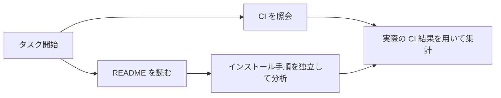

## 5. 非同期ツール呼び出し：`async def` を書けば実現するわけではない

### 5.1 混同しやすい 4 種類の「非同期」

| 種類 | 誰が作業を継続するか | ツール結果が未着の間にモデルは進めるか？ |
|---|---|---|
| HTTP 非同期クライアント | アプリスレッドはブロックしない | 必ずしもそうではなく、モデルはツール結果を待つ可能性がある |
| 複数ツールの並列実行 | 複数のツールが同時に実行される | 必ずしもそうではなく、モデルはすべての結果を待つ可能性がある |
| Background response | ユーザーが同期リクエストを保持する必要がない | あくまでレスポンスタスクがバックグラウンドで動くだけで、ツール依存のセマンティクスを推論できるわけではない |
| モデルプロトコルレベルの async tool | ツールが pending の間もモデルが独立して推論/呼び出しを継続する | 可能。ただし未返却の結果を仮定してはならない |

現在の API では、function または custom ツール上の `async: true` によって最後のセマンティクスを表現します。ツールは依然としてアプリ側で実行され、結果は元の `call_id` で戻します。これは Background mode とは異なり、現行ドキュメントではこの種の async ツールを PTC で使うことは許可されていません。マルチエージェントモードにもさらなる組み合わせ制限があります。[Async tool calling](https://developers.openai.com/api/docs/guides/async-tool-calling)

### 5.2 具体例

タスク：「CI の結果を照会し、README にインストール手順が記載されているか確認する。」

```text
基本の直列：CI 照会 40 秒 → README 読み込み 5 秒 → 集計 2 秒
ツール並列：CI と README を同時開始 → 両方のツールを待つ → 集計
非ブロッキング Agent：まず CI を開始 → README を読みインストール手順を分析 → CI の結果が戻る → 結論を統合
```

モデルは CI が pending の間に README の抜けを指摘できますが、「CI は通過した」と述べることはできません。正しい依存グラフは次のとおりです。



### 5.3 なぜ高速化しうるのか

モデルの独立作業時間を `M`、ツール時間を `T`、協調コストを `O` と仮定します。

```text
直列：M + T
理想的な重なり：max(M, T) + O
理論的節約：min(M, T) - O
```

これはあくまで遅延モデルです。次のステップでツール結果を必ず知る必要があるなら結局待つことになりますし、すべてのツールが同じ DB ロックを取り合うなら並列でも顕著には速くなりません。「いくつ async を呼び出したか」ではなく、critical path、p50/p95、失敗率を測定すべきです。

### 5.4 Harness が補うべき実装は何か

最小の pending registry は次の情報を記録する必要があります。

```text
key = (thread_id, turn_id, call_id)
value = {
  tool_name, arguments_signature, created_revision,
  task_handle, timeout, status, result, delivered
}
```

状態遷移は次のように設計できます。

```text
created → queued → running → completed / failed / cancelled
                               ↓
                       result persisted → delivered
```

さらに次を扱う必要があります：ツール失敗時の構造化エラー返却、重複投入時の再実行防止、同一 ID で異なる引数の場合は拒否、並行数の制限、タイムアウトにキュー時間が含まれるか実行時間のみかを明示、遅延到着した結果を新しい要求に誤用しないこと、キャンセルの実行系への伝播。

### 5.5 なぜストリームから早期にツールを起動すべきか

もしアプリケーションが `responses.create()` からレスポンス全体を受信し終えてからツールを起動すると、モデルはすでに独立回答を生成し終えているかもしれず、実際の I/O と生成が十分に重ならなくなります。

ストリーミング実装は**完全なツール呼び出し項目が生成された時点**でタスクを起動すべきで、未完成の JSON 引数の断片を実行してはいけません。付録の `live_api.py async` は `response.output_item.done` で作業スレッドを登録し、ストリーム終了後に結果を返送します。これは実際の API 接続例ですが、今回は課金モデルを呼び出していません。

```json
{
  "type": "function",
  "name": "scan",
  "async": true,
  "parameters": {
    "type": "object",
    "properties": {"module": {"type": "string"}},
    "required": ["module"],
    "additionalProperties": false
  }
}
```

結果を返送する際は元の `call_id` を保持し、同時に最新のレスポンスチェーンに接続します。これにより、ツール実行中に追加された会話を取りこぼしません。

### 5.6 Wait と yield の関係

ツールにまず待機可能なタスク識別子を返させ、モデルは作業を続け、実際に結果が必要になった時点で wait する、という設計にできます。このメカニズムはアプリケーション層でも実装でき、必ずしも API の async フラグを必要としません。

ただし `job_handle` と API の `call_id` は同じものではありません。前者はあなたのビジネス側レジストリの名前かもしれず、後者はプロトコルが結果を照合するための識別子です。モデルが独自に定義した handle を、モデルが下層の ID として知っているものと混同しないでください。

Codex の Code Mode ソースには、cell の起動、初回出力、yield 後の生存、その後の wait/terminate の処理パスが見えます。これは非ブロッキング実行にはツール宣言の変更だけでなく完全なライフサイクル管理が必要であることを示しています。[execute handler](https://github.com/openai/codex/blob/ddea03ad049142943bdbf13e937b1d67e8c1ba0c/codex-rs/core/src/tools/code_mode/execute_handler.rs)、[wait handler](https://github.com/openai/codex/blob/ddea03ad049142943bdbf13e937b1d67e8c1ba0c/codex-rs/core/src/tools/code_mode/wait_handler.rs)

### 5.7 ローカル Demo で何が検証されたか

`runtime_demo.py` は 2 つのモックツールを同時に起動し、両者が終わる前に独立作業を記録し、ユーザーの変更を 1 度処理します。テストでは不安定な所要時間の閾値で並列性を判定するのではなく、**2 番目のツールの開始イベントが 1 番目のツールの完了イベントより前に現れる**ことを検証します。

LLM は呼び出していないので、実証しているのは Python のスケジューリングと状態管理のメカニズムであって、Astra の推論能力ではありません。今回の出力の約 0.123 秒はあくまでシミュレーションの待機時間であり、「Codex の性能が xx% 向上した」といった記述をしてはいけません。

<a id="steering"></a>
## 6. Mid-turn steering：実行中に要件を変更しつつ整合性をどう保つか

### 6.1 なぜ基本の Harness では難しいのか

基本の循環は多くの場合、「1 ターン終了後」に次のユーザー入力を読みます。ユーザーが「コミットせず、分析のみ」と言いたくても、モデルは元の計画のまま実行を続けます。単純に cancel して再起動するのもコストがかかります：中間状態の喪失、ツールの重複、外部動作が既に発生したかを正確に判断できないなどです。

Steering の目的は、完了済みの作業を保持しつつ、新たな要求を実行中のタスクに接続することです。

### 6.2 2 層の steering を混用しない

| レイヤー | インターフェース | 対象オブジェクト |
|---|---|---|
| Codex App Server | `turn/steer` | あるスレッドのアクティブな turn |
| Responses API | WebSocket `response.steer` | 同じ接続上の対象レスポンス |

App Server のプロトコルテストには turn ID などの挙動検証が含まれます。そのクライアントインターフェースは Responses API のモデルサービスインターフェースと同一のスキーマではありません。通常の HTTP `/responses` に `turn/steer` フィールドを勝手に付けて送ることはできません。[App Server steering テスト](https://github.com/openai/codex/blob/ddea03ad049142943bdbf13e937b1d67e8c1ba0c/codex-rs/app-server/tests/suite/v2/turn_steer.rs)

App Server の例：

```json
{
  "id": 20,
  "method": "turn/steer",
  "params": {
    "threadId": "実際のthreadId",
    "expectedTurnId": "実際のアクティブturnId",
    "input": [{"type": "text", "text": "読み取り分析のみに変更し、ファイル修正は行わないでください。"}]
  }
}
```

`expectedTurnId` は誤配信防止の検証に相当します。クライアントが「まだ実行中」と考えている turn が既に終了している可能性があり、サーバーが黙って更新を次のターンに適用してはいけないためです。

### 6.3 Responses API での適用点

現在の公式ガイドによれば、Astra は WebSocket steering をサポートします。リクエストが受理されても、すでに出力された内容を書き換えることも、既に実行された動作を取り消すこともありません。適切な境界で successor response を接続します。**successor の `response.created` こそが更新のコミット点です。** アプリツールの結果や承認に依存する場合は pending に入ります。[Steering guide](https://developers.openai.com/api/docs/guides/steering)

```text
response.created(parent)
    ↓ ユーザーが response.steer を送信
response.steer.accepted                 キュー投入済み
    ↓ 現在の出力境界の終了 / 必須入力の待機
response.incomplete(reason=steered)     出現しうる；parent が正常完了する場合もある
    ↓
response.created(successor)             更新は後継レスポンスにコミット済み
    ↓
response.completed(successor)           後継レスポンス完了
```

client-owned なツールや未完了の承認がある場合：

```text
accepted → parent completed → steer.pending(required_input)
           → 保存済みのツール結果で required_input を埋める
           → 同じ parent に対し 1 度だけ continuation を送信
           → successor created
```

**受理済みの steering 内容を再送しないでください。また、required_input を埋めるために副作用のあるツールを再実行してはいけません。** 切断は「リクエストが受理されなかった」ことを意味しません。厳密な制約としてはさらに、サポートされる user 入力のみ許可されること、現行の参照仕様では conversation との結合や自動 compaction との組み合わせがサポートされないことも挙げられます。[Responses WebSocket イベント定義](https://developers.openai.com/api/reference/cli/resources/beta/subresources/responses)

### 6.4 「生成しながら変更」はサンプル済みトークンの書き換えではない

面接での回答はこうあるべきです：サーバーは新たな入力を後続の継続プロセスに組み込み、プロトコルが保証する安全境界で適用する。インタラクション上の現象から、KV cache や現在のニューラルネットワークの活性値、既に生成されたトークンをその場で書き換えたと断言することはできません。

### 6.5 既に発行済みの書き込み操作はどうするか

旧計画が「設定を修正して公開する」で、新要件が「読み取り分析のみ」だと仮定します。合理的な設計は次のとおりです。

1. 新要件を受け取った時点でビジネス revision を増やす。
2. まだディスパッチされていない変更計画を無効化し、再判断する。
3. 実行中の読み取り専用ツールの結果は保持できるが、適用範囲を確認する。
4. 未コミットの書き込み操作は、実行前に再度 revision と権限を確認する。
5. 完了済みの外部書き込みは補償やロールバックで対応するしかなく、steering で取り消せたと主張してはいけない。

付録 Runtime の `commit()` は revision を確認します。テストにより、revision 0 の旧案が revision 1 以降にコミットされないことが実証されています。教材上の案を記録するだけで、実際の外部システムを操作するわけではありません。

本物のデータベース書き込みでは、バージョン検証と書き込みを同じトランザクション/CAS 境界に置くべきです。リモート呼び出しには冪等キーと突き合わせが必要です。アプリ内で「先に判定してから HTTP を呼ぶ」構造では、依然として競合ウィンドウが残ります。

### 6.6 面接での回答

> Mid-turn steering の難しさは新しいメッセージを受信することだけではなく、入力の受理点、適用点、および完了済み副作用の境界を定義することです。アクティブ turn の検証、要件の revision、実行前の権限確認を用い、完了済みのツール結果を保持します。切断後の未知状態については、盲目的にリトライせず、まず突き合わせを行います。

<a id="ptc"></a>
