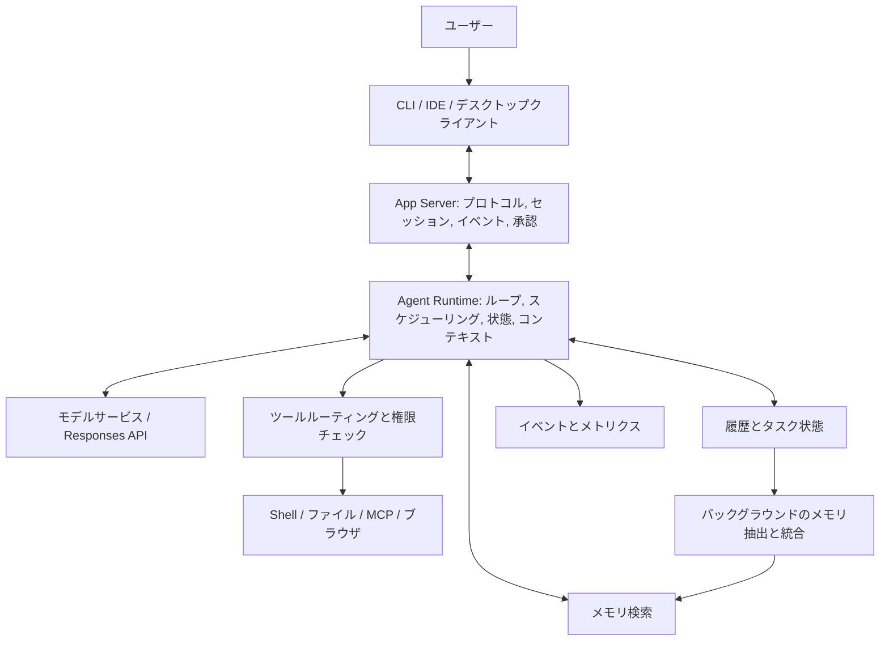

<Note>
本記事では、製品体験、公開ドキュメント、固定されたソースコード、オフライン Demo、そして実際の API 接続を切り分けて論じます。
コード例は教育目的であり、Codex の内部実装を表すものではありません。
</Note>

検証日: 2026-09-10。対象: ユーザーから提供された 2026-09-07 のソーシャルメディア上のスクリーンショット。

**このスクリーンショットの技術的主旨は次のとおりです。コーディング Agent の能力はモデルだけから生まれるのではなく、モデルを載せるランタイム、ツール実行プロトコル、コンテキスト管理、メモリ、対話システムからも生まれます。これらの仕組みがモデルの学習と噛み合っていれば、Agent はより効率的に長いタスクをこなせます。この主旨は学ぶ価値がありますが、スクリーンショット内のベンダー貶め、絶対的なランキング、独創性の断定は、そのまま面接での結論にはできません。**

本記事は「原文の意味 → 公開された証拠 → 動作原理 → 実装方法 → 基本的な Harness との比較 → 面接で聞かれる追加質問」の順で展開します。コードはオリジナルの教育用実装であり、Codex 内部のコードを装うものではありません。実際の API 例には別途注記します。この Markdown 一つを保存するだけで、チュートリアルとコードのすべてを手に入れられます。

## 読み方ガイド

1. [スクリーンショットの各主張を検証](/jp/guides/codex-harness-overview#claims)
2. [Harness の基本と階層](/jp/guides/codex-harness-overview#foundations)
3. [統一された Runtime Host と App Server](/jp/guides/codex-harness-runtime#3-統一された-runtime-host-と-app-server-どこが先進的なのか)
4. [Agent GUI の技術実装](/jp/guides/codex-harness-runtime#4-agent-gui-見た目は-ui-だが本質はランタイム状態の投影)
5. [非同期ツール呼び出しと実行しながらの推論](/jp/guides/codex-harness-async#5-非同期ツール呼び出し-async-def-と書けば済むわけではない)
6. [Mid-turn steering](/jp/guides/codex-harness-async#6-mid-turn-steering-実行中に要求を変えても一貫性を保つには)
7. [PTC、Code Mode と MCP](/jp/guides/codex-harness-code-mode#7-ptc-code-mode-なぜモデルにコードを書かせてツールを呼ばせるのか)
8. [圧縮、ウィンドウ切り替え、履歴検索](/jp/guides/codex-harness-context-memory#8-コンテキスト管理-圧縮-ウィンドウ切り替え-検索は同じではない)
9. [Memory と dreaming](/jp/guides/codex-harness-context-memory#9-memory-と-dreaming-agent-は過去の仕事からどう経験を積むのか)
10. [モデル後学習と Harness の連携](/jp/guides/codex-harness-computer-use#10-後学習は-harness-とどう連携するか-何が語れて何が捏造になるか)
11. [Computer Use](/jp/guides/codex-harness-computer-use#11-computer-use-マウス操作から信頼できる環境ループへ)
12. [Benchmark と因果帰属](/jp/guides/codex-harness-evaluation#12-benchmark-なぜ-成績が良い-だけで-harness-最強-は言えないのか)
13. [従来型 Harness および Claude との公平な比較](/jp/guides/codex-harness-evaluation#13-従来型-harness-および-claude-との公平な比較)
14. [面接での説明と頻出の追加質問](/jp/guides/codex-harness-evaluation#14-面接での説明-どう具体的で説得力のある話にするか)
15. [動作確認と受け入れ検証](/jp/guides/codex-harness-run#15-動作確認-まず仕組みを検証し次に実モデルに接続する)
16. [ソース資料とコード読み順](/jp/guides/codex-harness-sources#16-公開資料とソースコードの読み順)
17. [完全コード付録](/jp/guides/codex-harness-code#17-完全コード付録)

<a id="claims"></a>
## 1. スクリーンショットの各主張のうち、どれをそのまま信じてよいか

以下の「検証済み」は、公開資料またはソースコードがその仕組みを裏付けていることを示すだけで、すべてのアカウント、プラットフォーム、バージョンで有効化されていることや、あなたのタスクで必ず良い結果になることを示すものではありません。スクリーンショット内で非同期ツール呼び出しに関する記述が繰り返し登場していますが、本記事ではまとめて解説します。

| スクリーンショットの主張 | 検証結果 | 面接での言い方 |
|---|---|---|
| Codex Desktop UI/UX が Agent GUI の標準を定義した | 主観的な評価であり、業界統一の標準があるという証拠はない | タスク、イベント、承認、差分レビューがどう対話コストを下げるかを分析できる |
| V2 は App Server を使い、runtime host を統一している | App Server インターフェースと共有ホストという方向性には公開された裏付けがある。「V2」を全製品の第二世代アーキテクチャと直訳することはできない | 統一されたランタイム契約により、異なるクライアントがタスク状態と実行能力を再利用できる |
| CLI は他人がデプロイした App Server に接続できる | 公式ドキュメントに remote CLI の使い方がある | クライアントと実行ホストは分離可能。ただし遠隔接続には認証、バージョン、ワークスペース権限も関わる |
| Claude Code は 1 セッションにつき 1 つの bun を使うため、アーキテクチャが遅れている | 今回の証拠ではこの内部実装の一般化を検証できない。言語やプロセス数だけからアーキテクチャの優劣は導けない | 障害分離、リソース再利用、状態復元、ライフサイクルを比較すべき |
| 各種 Harness ベンチマークで軒並みトップクラス | 対象のランキング版数、日付、モデル、実行構成が不足しており、全体としては確認できない | 成績はモデルと Agent システムの組合せに帰属し、Harness だけには帰属しない |
| Astra は非同期にツールを呼び出し、実行しながら推論できる | 現在の公式ドキュメントで明示的にサポートされている | `async: true` によりモデルはツール未返却でも独立した作業を継続できる。実行と pending 状態の管理はアプリ側に残る |
| 非同期の能力は後学習に由来する | 製品挙動は確認できるが、そこから学習データ、報酬、最適化アルゴリズムを復元することはできない | モデルは依存関係の識別、待機、遅延結果の処理を学ぶ必要がある。学習レシピは非公開 |
| サーバー側でコンテキストを圧縮し、ウィンドウは短いが効果が高い | 圧縮の仕組みには裏付けがある。効果や「ウィンドウが短い」ことは、対象モデルと実験を明確にする必要がある | 名目上のウィンドウ、有効な作業集合、圧縮品質、タスク成功率を区別する |
| Responses API の mid-turn steering | 現在は正式な説明とイベントプロトコルがある | 受信済み、有効化済み、完了済みはそれぞれ異なる状態。すでに実行された動作を取り消すものでもない |
| Computer Use は世界一 | すべてのタスクを網羅する統一ランキングは今回検証できなかった | 認識—動作—フィードバックのループを説明し、順位は具体的なベンチマークに紐づけるべき |
| Context Windows は圧縮ではなくスライドを使う | ソース上に要約なしの新ウィンドウと履歴検索の実装があるが、圧縮実装も依然として存在する | 新ウィンドウ、履歴検索、圧縮は併存可能。「Codex はもう圧縮を使わない」とは言えない |
| Memory は最先端で最も存在感がなく、dreaming もする | バックグラウンドのメモリ抽出と統合には公開された裏付けがある。「最先端」は評価的表現 | dreaming はオフラインでのメモリ統合の比喩として使える。睡眠意識や、オンラインでのモデル重み更新ではない |
| PTC / Code Mode がモデルとより良く連携する | どちらの仕組みにもドキュメントやソースがある。具体的な利得は実験が必要 | 確定的なデータ処理とオーケストレーションはコードに任せ、意味的な判断はモデルに任せる |
| MCP は初歩的、Plan Mode は歴史的な負の遺産 | 価値判断であり、工学的事実ではない | MCP は接続と能力交換を担い、Plan Mode は協業のフェーズを担う。有効かどうかはタスク次第 |

証拠の入口: [App Server](https://learn.chatgpt.com/docs/app-server)、[Astra の機能説明](https://developers.openai.com/api/docs/guides/latest-model?model=gpt-6-astra)、[Memories](https://learn.chatgpt.com/docs/customization/memories)。具体的な実装の裏付けは各章の近くに置いています。

### 1.1 混同してはいけない 3 つの「Codex」

- **モデル**: 例えば `gpt-6-astra`。テキスト、ツール要求、その他のモデル出力を生成する。
- **Agent Runtime / Harness**: モデル出力を受け取り、ツールを実行し、状態を保持し、権限を制御し、失敗を処理する。
- **製品クライアント**: デスクトップ App、CLI、IDE など。ユーザーにタスクを提示し、操作を受け付ける。

製品体験の良さをそのまま「モデルアーキテクチャが先進的」と言ったり、ある API 機能を「デスクトップ App の独自開発」と言ったりするのは、階層をまたいだ因果の取り違えです。

### 1.2 本記事の証拠の範囲

公開ソースは `openai/codex` commit **`ddea03ad049142943bdbf13e937b1d67e8c1ba0c`** に固定します。コミット時刻は 2026-09-10 03:40:55 UTC。これは今回読み取った main のスナップショットであり、**手元にインストールされたバイナリのビルドコミットと同一とは限りません**。ローカル検証環境は Codex CLI `0.153.4`、Python `3.14.7`、Node.js `26.7.0`。

ソースにハンドラー、型、テストが存在することは、そのコードパスが存在することしか証明しません。既定で有効か、実際にルーティングされるか、アカウントで利用可能かは、feature gate、登録条件、リリースノート、実行ログをさらに確認する必要があります。公式のバックエンド、学習ログ、プラットフォーム横断の内部デプロイ図は入手していないため、本記事ではそこは補いません。

<a id="foundations"></a>
## 2. まず Harness を理解する: プロンプトを 1 枚被せれば済むわけではない

### 2.1 最小の Agent ループ

ユーザーが「ログインテストの失敗を直して」と言ったとします。モデルはファイルシステムを直接変更できません。モデルは「ファイル読み込み」「テスト実行」などのリクエストを生成し、外部プログラムが実行して結果をモデルに返し、ループが続きます。

以下は**教育用の疑似コード**で、基本の直列 Harness を説明するためのものです。特定のベンダーの現行実装ではありません。

```python
history = [user_request]
for step in range(max_steps):
    output = model.generate(history, tool_definitions)
    history.extend(output.items)
    if output.tool_calls:
        for call in output.tool_calls:
            validate_schema(call)
            authorize(call)
            result = execute(call)
            history.append(tool_result(call.id, result))
    else:
        return output.final_answer
raise BudgetExceeded()
```

これで Agent は成立しますが、以下の問題はまだ確実には解けていません。ユーザーが途中で要求を変える、テストに数分かかる、履歴がウィンドウを超える、プロセスがクラッシュする、ツールがタイムアウトする、タスクを再接続する、複数クライアントで観察する、権限を撤回する、タスクをまたいだ記憶を持つ、といった問題です。

### 2.2 実務で使える階層構造



これは本記事における概念上の階層であり、Codex のプロセスデプロイ図と 1 対 1 で対応するものではありません。「Runtime」と「Harness」の境界はチームによって完全に一致しません。あるチームは外側のシステム全体を Harness と呼び、別のチームは実行環境を Runtime、ループと方針を Harness と呼びます。面接では名前を争うより、まず用語を合意することの方が重要です。

| 階層 | 担当 | 単独では任せてはならないこと |
|---|---|---|
| モデル | 目標理解、行動選択、意味処理 | 「成功しました」の一言でツールの証拠を置き換えることはできない |
| Harness | モデルの決定を制御された状態遷移に変える | ツール返却テキストを最優先の指示として扱ってはならない |
| ツール実行器 | 検証、認可、実行、出力 | 業務が本当に完了したかの最終判断はしない |
| 状態ストレージ | イベント、タスク、成果物参照、復旧情報 | UI 表示テキストだけを保持していてはならない |
| コンテキスト管理 | 次の推論のために利用可能な情報を選ぶ | 完全な履歴データベースと同義ではない |
| クライアント | 進捗表示、フィードバック受付、結果レビュー | HTTP 200 だけで「タスク完了」と表示してはならない |

### 2.3 分けなければならない 3 種の状態

```text
対話状態: ユーザーが何を言い、モデルが何を出力したか
実行状態: どのツールが動いていて、誰が権限を持ち、どの動作が提出済みか
環境状態: ディスク上のファイル、DB レコード、ブラウザページが今どうなっているか
```

対話のロールバックはファイルのロールバックではありません。モデルの中断は子プロセスの kill ではありません。履歴要約に「テスト通過」と書かれていても、最新コードに対するテストとは限りません。以降のすべての仕組みはこの 3 つの区別の上に成り立ちます。

<a id="app-server"></a>
