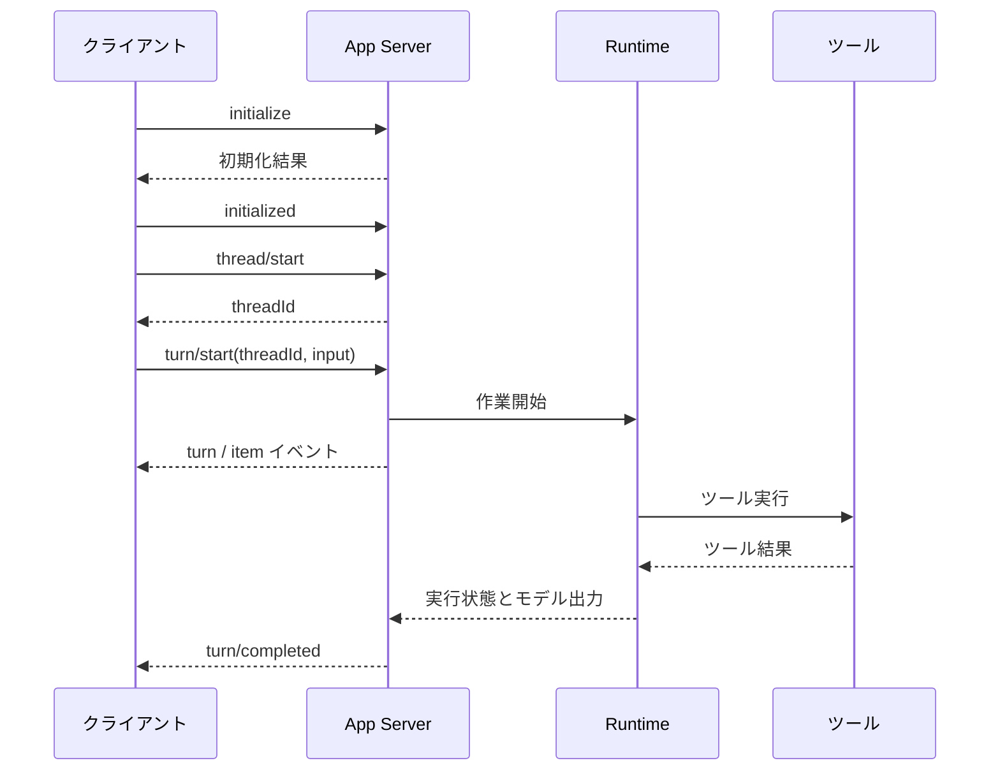

## 3. 統一 Runtime Host と App Server は何が先進的なのか

### 3.1 「全端統一」の最大の価値は契約の統一

素朴な設計では、CLI・IDE・デスクトップの各クライアントがそれぞれ独自のループを実装しがちです。「承認後に継続する」機能を追加する場合、各クライアントで個別にコードを修正する必要があり、状態のセマンティクスが分岐しやすくなります。

共有ランタイムの発想は次のとおりです。クライアントは構造化された意図を送信し、ホストがタスクと実行を管理し、イベントストリームをクライアントに返します。ツール開始、ツール終了、承認待ち、完了、失敗などの状態を、同一のセマンティクスで表現できます。

App Server は双方向通信と、thread、turn、item などのプロトコルプリミティブを提供します。公式ドキュメントによれば、リッチクライアント統合に利用でき、CLI からリモートホストへの接続もサポートします。**これは「再利用可能なホストインターフェース」を裏付けるものですが、すべての製品が単一の OS プロセスで動作していること、あるいはすべてのスレッドが同一の JavaScript ヒープを共有していることを証明するものではありません。** [App Server 公式ドキュメント](https://learn.chatgpt.com/docs/app-server)

```text
Thread：継続的な会話
  └─ Turn：1 回のユーザーリクエストとそれに続く一連の作業
       └─ Item：ユーザーメッセージ / モデルメッセージ / ツール実行 / ファイル変更など
```

注意：SDK によって「turn」の定義は完全には一致しません。Codex の製品としてのターン、1 回のモデル API レスポンス、ループ内の 1 回の model step を同じものとして扱わないでください。

### 3.2 1 回のリクエストはどのように流れるのか



プロトコルメッセージは JSON-RPC スタイルに従いますが、App Server はワイヤ上で `jsonrpc` フィールドを省略します。リクエストには `id` があり、通知には `id` がありません。逆方向の承認リクエストにも `id` があります。したがって、「最初の JSON 行を読んだらそれを現在のリクエストの結果とみなす」といった実装はできません。

```json
{"id":1,"method":"initialize","params":{"clientInfo":{"name":"interview_demo","version":"0.1.0"}}}
```

```json
{"method":"initialized","params":{}}
```

```json
{"id":2,"method":"thread/start","params":{}}
```

```json
{"id":3,"method":"turn/start","params":{"threadId":"実際に返されたスレッドID","input":[{"type":"text","text":"まずこのリポジトリの構造を説明してください。"}]}}
```

最後の 2 行はプロトコルの例示に過ぎず、今回の探査では送信していません。動作する完全なクライアントは付録の `app_server_client.py` を参照してください。このコードは initialize のみを実行し、実際の stdio ハンドシェイクを検証します。

### 3.3 なぜ request ID、thread ID、turn ID、call ID、cell ID を区別するのか

| ID | 用途 | 誤マッチで何が起きるか |
|---|---|---|
| request ID | 1 回の RPC リクエストとレスポンスを対応付ける | 承認応答を起動結果として扱ってしまう |
| thread ID | 会話とワークスペースの所属を確定する | タスク間でコンテキストや権限が混線する |
| turn ID | 進行中の作業を確定する | 新しい要件が終了済みの旧ターンに誤って追加される |
| call ID | ある 1 回のツール呼び出しと結果を対応付ける | ツール結果の混線、重複送信 |
| cell ID | サスペンド/ウェイト可能なコード実行単位を特定する | 誤ったコード単位を wait したりキャンセルしたりする |

これらの概念は関連しますが互換ではありません。サーバーが生成した ID はそのまま伝達すべきです。ビジネスレイヤーで追加する revision は要件の変化を記録するために使い、プロトコル本来のフィールドの代替として使用しないでください。

### 3.4 統一ホストの利益とコスト

| 設計 | 利益 | コスト |
|---|---|---|
| セッションごとに独立プロセス | ライフサイクルがシンプル、クラッシュ隔離が自然 | 初期化の重複、リソース再利用が困難、マルチクライアント接続に追加設計が必要 |
| 複数セッションで共有ホスト | ツール接続とプロトコルの再利用、統一的な監視と管理 | 状態の混線、リソース競合、共有障害の防止が必要 |
| 制御サービスと実行サンドボックスを分離 | 計算リソースを差し替え可能、永続状態を独立管理 | RPC、再接続、リース、バージョン互換のコストが増える |

**「1 セッション 1 プロセス」はアーキテクチャ上の原罪ではありません。** 信頼できないコードにとっては、より強い隔離が価値を持ちます。Rust、Bun、Node、Python のどれを選ぶかも、タスクスケジューリングと状態復元の設計が優れているかを証明するものではありません。

エンジニアリング上、共有ホストには少なくとも次のものが必要です：スレッド単位で分離された権限と状態、グローバルおよびスレッド単位の並行制限、有界キュー、出力バックプレッシャー、キャンセル伝播、切断復旧、バージョンネゴシエーション。統一実装は隔離の放棄を意味しません。

### 3.5 リモート接続とバージョンドリフト

公式ドキュメントの localhost の例：

```bash
codex app-server --listen ws://127.0.0.1:4500
# 別のターミナルから同じホストに接続
codex --remote ws://127.0.0.1:4500
```

「CLI が App Server に接続する」ことと「App Server が Code Mode Host に接続する」ことは、別の 2 つの接続です。前者は製品制御プロトコル、後者はコード実行ホストプロトコルです。

今回、実際のドキュメントとソースコードの差異も見つかりました。オンラインの App Server ドキュメントでは依然として `--code-mode-host wss://...` が示されていますが、固定リビジョンのソースコード中の `CodeModeHostTransport::Grpc` と URL 検証は `http/https` を受け付けます。したがって、本記事ではバージョン横断で汎用的なリモート Code Mode デプロイコマンドは提示しません。実際にデプロイするバージョンが生成する schema、ヘルプ、および対応するソースコードを基準にしてください。リモート公開ではさらに認証と伝送保護の設定が必要で、実験的インターフェースを自動的に本番保証と見なすことはできません。[固定リビジョンのソース：ホスト伝送設定](https://github.com/openai/codex/blob/ddea03ad049142943bdbf13e937b1d67e8c1ba0c/codex-rs/app-server/src/code_mode_host.rs)

### 3.6 面接での回答

> 統一 Runtime Host の核心は、Agent の実行セマンティクスをクライアントから引き離し、安定したタスクプロトコルで複数のフロントエンドを支えることだと理解しています。利益はセッション、ツール、承認、イベントの挙動の一貫性であり、コストは共有ホストで隔離、バックプレッシャー、復旧、バージョン互換を補う必要があることです。プロセス数や実装言語だけでアーキテクチャの優劣を判断することはしません。

<a id="gui"></a>
## 4. Agent GUI：見た目は UI、本質はランタイム状態の投影

スクリーンショットでは UI/UX が称賛されていますが、面接で議論する価値があるのは「UI がどのようにユーザーに『何が起きているか』と『まだ何を制御できるか』を伝えるか」です。本節はイベント駆動システムに基づくエンジニアリング設計であり、クローズドソースのデスクトップコードを復元したものだと主張するものではありません。

### 4.1 使いやすい UI にはどのような裏付けが必要か

| ユーザーが目にする体験 | 下層で必要な能力 |
|---|---|
| ツール実行中に進捗が見える | 型付けされたツールイベント、増分出力、安定した item ID |
| 途中で要件を追加できる | 入力チャネルと生成チャネルの併存、追加状態の明示 |
| タスクを停止できる | cancellation token、タスク/子プロセスのハンドル、最終停止イベント |
| ファイル変更をレビューできる | diff と実際のワークスペース状態が対応し、対象バージョンが明示される |
| 離席して戻っても結果が見える | 永続状態と補読メカニズム |
| 承認後に元のタスクを継続できる | 中断点の永続化、承認リクエスト ID、権限の再検証 |

フロントエンドのタイマーだけで「ファイル読み込み中」「もうすぐ完了」を偽装してはいけません。そうすると、バックエンドで失敗しても UI に成功と表示される可能性があります。

### 4.2 なぜ reducer が必要なのか

以下では**独自の教材用イベントプロトコル**を用います。Codex のフィールドではありません。reducer はイベントを UI 状態に更新し、「イベント処理」と「描画」を分離します。

```javascript
function reduce(state, event) {
  if (event.seq <= state.lastSeq) return state; // 適用済みのイベントは再適用しない
  const next = {...state, lastSeq: event.seq};
  if (event.kind === "tool.started")
    next.tools = {...state.tools, [event.callId]: {status: "running"}};
  if (event.kind === "tool.completed")
    next.tools = {...state.tools, [event.callId]: {status: "completed", result: event.result}};
  if (event.kind === "steer.accepted") next.pendingUpdate = event.updateId;
  if (event.kind === "steer.applied") next.pendingUpdate = null;
  if (event.kind === "turn.completed") next.status = event.status;
  return next;
}
```

前提として、サーバーは順序付きのイベントストリームを提供する必要があります。シーケンス番号に欠けが見つかった場合、`lastSeq` で欠落を隠すのではなく、補読やスナップショット再取得を行うべきです。複数スレッドのイベントはさらに thread/turn 単位で振り分ける必要があります。**教材用のイベントシーケンス番号を、App Server の各通知が持つフィールドに直接対応付けないでください。**

再接続では「スナップショット + スナップショットのカーソル以降のイベント」のパターンが有効です。スナップショットとカーソルが同一の一貫性境界から得られることを保証してください。そうしないと、スナップショットの読み取りと購読の間でイベントを取りこぼします。特定の製品がイベント再生をサポートするかは対応するプロトコルを確認する必要があり、UI が復旧しているように見えるからと実装を推測してはいけません。

### 4.3 インタラクションで最も重要な 3 つの区別

1. **リクエストの受理 ≠ 作業完了**：RPC の戻り値は起動確認ですか、それとも完了結果ですか？
2. **ツール完了 ≠ タスク成功**：テストコマンドが終了したからといって終了コード 0 とは限らず、終了コード 0 であっても受け入れ要件を満たしているとは限りません。
3. **新要件のキュー投入 ≠ 新要件の適用済み**：steering は実際の状態を提示すべきで、送信ボタンを押した瞬間に「調整済み」と宣言してはいけません。

<a id="async"></a>
