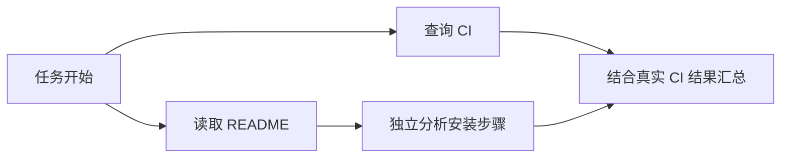

## 5. 异步工具调用：不是写一个 async def 就实现了

### 5.1 四种容易混淆的“异步”

| 类型 | 谁继续工作 | 模型是否可在结果缺席时推进？ |
|---|---|---|
| HTTP 异步客户端 | 应用线程不阻塞 | 不一定，模型可能仍等待工具结果 |
| 多工具并行执行 | 多个工具同时运行 | 不一定，模型可能等所有结果 |
| Background response | 用户无需保持同步请求 | 是响应任务在后台，不能据此推断工具依赖语义 |
| 模型协议级 async tool | 工具 pending 时模型继续独立推理/调用 | 可以，但不能假设未返回的结果 |

当前 API 通过函数或 custom 工具上的 `async: true` 表达最后一种语义；工具仍在应用侧执行，结果用原始 `call_id` 回传。它与 Background mode 不同，且当前文档不允许把此类 async 工具用于 PTC；多 Agent 模式还有额外组合限制。[Async tool calling](https://developers.openai.com/api/docs/guides/async-tool-calling)

### 5.2 一个具体例子

任务：“查询 CI 结果，并检查 README 是否说明了安装步骤。”

```text
基础串行：查询 CI 40 秒 → 阅读 README 5 秒 → 汇总 2 秒
并行工具：CI 和 README 同时开始 → 等待两个工具 → 汇总
非阻塞 Agent：先启动 CI → 阅读 README、分析安装步骤 → CI 返回 → 合并结论
```

模型可以在 CI pending 时指出 README 的缺漏，但不能说“CI 已通过”。正确依赖图是：



### 5.3 为什么可能加速？

假设模型独立工作耗时 `M`，工具耗时 `T`，协调成本 `O`：

```text
串行：M + T
理想重叠：max(M, T) + O
理论节省：min(M, T) - O
```

这只是延迟模型。若下一步必须知道工具结果，则仍要等待；若所有工具争同一把数据库锁，所谓并行也不会明显加速。应测 critical path、p50/p95 和失败率，而不只看“调用了多少个 async”。

### 5.4 Harness 必须补哪些实现？

一个最小 pending registry 需要记录：

```text
key = (thread_id, turn_id, call_id)
value = {
  tool_name, arguments_signature, created_revision,
  task_handle, timeout, status, result, delivered
}
```

状态转换可设计成：

```text
created → queued → running → completed / failed / cancelled
                               ↓
                       result persisted → delivered
```

还需要处理：工具失败返回结构化错误；重复投递不重新执行；相同 ID 配不同参数必须拒绝；并发受限；超时包含排队还是只含执行要说清；迟到结果不能误用于新需求；取消要传播到真实执行器。

### 5.5 为什么要从流中尽早启动工具？

如果应用等 `responses.create()` 收完整个响应后才启动工具，模型可能已经生成了独立回答，实际 I/O 与生成就没充分重叠。

流式实现应在**完整工具调用项已生成**时启动任务，不能拿尚未完成的 JSON 参数片段执行。附录 `live_api.py async` 在 `response.output_item.done` 上注册工作线程；流结束后把结果回传。这是一个真实 API 接线示例，但本次未调用付费模型。

```json
{
  "type": "function",
  "name": "scan",
  "async": true,
  "parameters": {
    "type": "object",
    "properties": {"module": {"type": "string"}},
    "required": ["module"],
    "additionalProperties": false
  }
}
```

结果回传时保持原始 `call_id`，同时接到最新 response 链上，避免丢掉工具执行期间新加入的对话。

### 5.6 Wait 与 yield 的关系

你可以让工具先返回可等待的任务标识，模型继续工作，等真正依赖结果时再 wait。这个机制在应用层也能实现，不一定要求 API 的 async 标志。

但是 `job_handle` 和 API `call_id` 不是同一个东西：前者可能是你业务注册表的名字，后者是协议匹配结果的标识。不要把模型自定义的 handle 当成模型已经知道的底层 ID。

Codex Code Mode 源码里能看到启动 cell、初次输出、yield 后继续存活，以及后续 wait/terminate 的处理路径。这证明非阻塞运行需要完整生命周期管理，不是只改工具声明。[execute handler](https://github.com/openai/codex/blob/ddea03ad049142943bdbf13e937b1d67e8c1ba0c/codex-rs/core/src/tools/code_mode/execute_handler.rs)、[wait handler](https://github.com/openai/codex/blob/ddea03ad049142943bdbf13e937b1d67e8c1ba0c/codex-rs/core/src/tools/code_mode/wait_handler.rs)

### 5.7 本地 Demo 验证了什么？

`runtime_demo.py` 同时启动两个模拟工具，在它们结束前记录独立工作，并处理一次用户变更。测试不用不稳定的耗时阈值判断并行，而是验证**第二个工具开始事件出现在第一个完成事件之前**。

它没有调用 LLM，所以证明的是 Python 调度与状态管理机制，不是 Astra 推理能力。本次输出约 0.123 秒仅是模拟等待时间，不能写成“Codex 性能提升 xx%”。

<a id="steering"></a>
## 6. Mid-turn steering：运行中改需求，怎样保持一致性？

### 6.1 为什么基础 Harness 难做？

基础循环往往只在“一轮结束后”读下一条用户输入。用户想说“不要提交，只分析”，但模型仍沿原计划执行。简单 cancel 再重启也有代价：丢失中间状态、重复工具、不能准确判断外部动作是否已经发生。

Steering 的目标是保留已完成工作，把新增要求接到正在运行的任务中。

### 6.2 两层 steering，不要混用

| 层 | 接口 | 目标对象 |
|---|---|---|
| Codex App Server | `turn/steer` | 某个 thread 的活动 turn |
| Responses API | WebSocket `response.steer` | 同连接上的目标 response |

App Server 的协议测试包含 turn ID 等行为验证；它的客户端接口与 Responses API 的模型服务接口不是同一份 schema。不能对普通 HTTP `/responses` 随便发一个 `turn/steer` 字段。[App Server steering 测试](https://github.com/openai/codex/blob/ddea03ad049142943bdbf13e937b1d67e8c1ba0c/codex-rs/app-server/tests/suite/v2/turn_steer.rs)

App Server 示例：

```json
{
  "id": 20,
  "method": "turn/steer",
  "params": {
    "threadId": "实际threadId",
    "expectedTurnId": "实际活动turnId",
    "input": [{"type": "text", "text": "改成只读分析，不执行文件修改。"}]
  }
}
```

`expectedTurnId` 相当于防误投校验：客户端认为仍在运行的 turn 可能已经结束，服务端不能悄悄把更新应用给下一轮。

### 6.3 Responses API 的生效点

当前官方 guide 说明 Astra 支持 WebSocket steering。请求被接受后，并不修改已经发出的输出，也不撤销已执行动作。它在适当边界衔接 successor response；**successor 的 `response.created` 才是更新提交点**。依赖应用工具结果或审批时，会进入 pending。[Steering guide](https://developers.openai.com/api/docs/guides/steering)

```text
response.created(parent)
    ↓ 用户发送 response.steer
response.steer.accepted                 已入队
    ↓ 结束当前输出边界 / 等待必需输入
response.incomplete(reason=steered)     可能出现；也可能 parent 正常完成
    ↓
response.created(successor)             更新已提交到后继响应
    ↓
response.completed(successor)           后继响应完成
```

有 client-owned 工具或审批未完成时：

```text
accepted → parent completed → steer.pending(required_input)
           → 用已保存的工具结果填补 required_input
           → 对同一 parent 提交一次 continuation
           → successor created
```

**不要再次发送已 accepted 的 steering 内容，不要为了填 required_input 重跑有副作用的工具。** 断线也不等于请求未接受。精确限制还包括：只允许支持的 user 输入；当前参考不支持与 conversation 绑定或自动 compaction 组合。[Responses WebSocket 事件定义](https://developers.openai.com/api/reference/cli/resources/beta/subresources/responses)

### 6.4 “边生成边改”不等于改写已经采样的 token

面试回答应是：服务端把新增输入纳入后续继续过程，在协议承诺的安全边界生效。你不能从交互现象断言它原地修改了 KV cache、当前神经网络激活值或已生成 token。

### 6.5 已经发出去的写操作怎么办？

假设旧计划准备“修改配置并发布”，新要求是“只读分析”。合理设计是：

1. 收到新要求时增加业务 revision。
2. 尚未派发的变更计划失效，重新判断。
3. 已在运行的只读工具可保留结果，但检查适用范围。
4. 未提交的写操作在执行前再次检查 revision 与权限。
5. 已完成的外部写操作只能通过补偿或回滚处理，不能声称被 steering 撤销。

附录 Runtime 的 `commit()` 检查 revision；测试证明 revision 0 的旧方案不能在 revision 1 后被提交。它只记录教学方案，没有操作真实外部系统。

真正数据库写入应把版本校验和写入放在同一事务/CAS 边界；远端调用要使用幂等键和对账。应用内“先判断再调用 HTTP”仍有竞态窗口。

### 6.6 面试回答

> Mid-turn steering 的难点不只是接收一条新消息，而是定义输入的接受点、生效点与已完成副作用的边界。我会使用活动 turn 校验、需求 revision 和执行前的授权检查，保留已完成工具结果；对断线后的未知状态先对账，不盲目重试。

<a id="ptc"></a>
