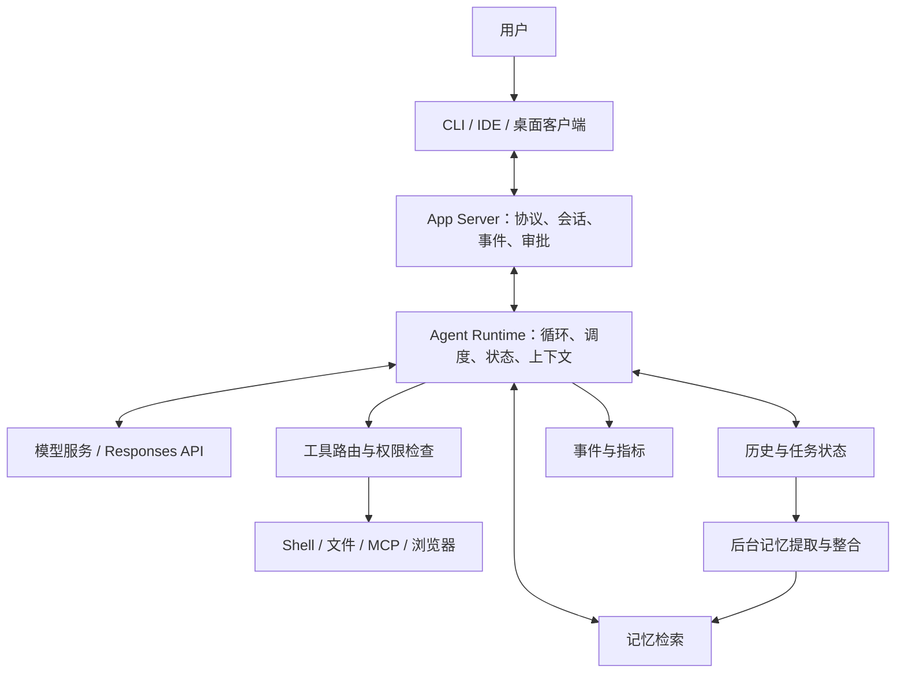

<Note>
本文把产品体验、公开文档、固定源码、离线 Demo 和真实 API 接线分开讨论。
代码示例用于教学，不代表 Codex 的内部实现。
</Note>

核查日期：2026-09-10。对象：用户提供的 2026-09-07 社交媒体截图。

**这段话的技术主旨是：编码 Agent 的能力不只来自模型，还来自承载模型的运行时、工具执行协议、上下文管理、记忆和交互系统；如果这些机制与模型训练相匹配，Agent 可以更高效地完成长任务。这个主旨值得学习，但截图中的厂商贬损、绝对排名、原创性判断，不能直接当面试结论。**

本文按“原话是什么意思 → 公开证据 → 工作原理 → 如何实现 → 与基础 Harness 对比 → 面试追问”展开。代码是原创教学实现，不冒充 Codex 内部代码；真实 API 示例单独标注。你只保存这一份 Markdown，也能获取全部教程与代码。

## 阅读导航

1. [截图逐条核查](/zh/guides/codex-harness-overview#claims)
2. [Harness 基础与分层](/zh/guides/codex-harness-overview#foundations)
3. [统一 Runtime Host 与 App Server](/zh/guides/codex-harness-runtime#3-统一-runtime-host-与-app-server-到底先进在哪里？)
4. [Agent GUI 的技术实现](/zh/guides/codex-harness-runtime#4-agent-gui：看上去是界面，本质上是运行时状态的投影)
5. [异步工具调用与边执行边推理](/zh/guides/codex-harness-async#5-异步工具调用：不是写一个-async-def-就实现了)
6. [Mid-turn steering](/zh/guides/codex-harness-async#6-mid-turn-steering：运行中改需求，怎样保持一致性？)
7. [PTC、Code Mode 与 MCP](/zh/guides/codex-harness-code-mode#7-ptc-/-code-mode：为什么让模型写代码来调用工具？)
8. [压缩、窗口切换、历史检索](/zh/guides/codex-harness-context-memory#8-上下文管理：压缩、换窗口、检索不是一回事)
9. [Memory 与 dreaming](/zh/guides/codex-harness-context-memory#9-memory-与-dreaming：agent-如何从过去的工作中积累经验？)
10. [模型后训练与 Harness 协同](/zh/guides/codex-harness-computer-use#10-后训练如何与-harness-配合？哪些能讲，哪些不能编？)
11. [Computer Use](/zh/guides/codex-harness-computer-use#11-computer-use：从“会点鼠标”到可靠的环境闭环)
12. [Benchmark 与因果归因](/zh/guides/codex-harness-evaluation#12-benchmark：为什么“成绩好”不能直接证明-harness-最强？)
13. [与传统 Harness、Claude 的公平对比](/zh/guides/codex-harness-evaluation#13-与传统-harness、claude-的公平对比)
14. [面试表达与高频追问](/zh/guides/codex-harness-evaluation#14-面试表达：怎么把这些内容讲得具体而可信？)
15. [动手运行与验收](/zh/guides/codex-harness-run#15-动手运行：先验证机制，再接真实模型)
16. [源码导航与资料](/zh/guides/codex-harness-sources#16-公开资料与源码阅读顺序)
17. [完整代码附录](/zh/guides/codex-harness-code#17-完整代码附录)

<a id="claims"></a>
## 1. 截图中的每一条说法，哪些可以直接相信？

下面的“已核实”只表示公开资料或源码支持这一机制，不表示所有账号、平台、版本均已启用，也不表示它在你的任务上必然更好。截图里异步工具调用的一段重复出现，本文合并解释。

| 截图说法 | 核查结论 | 面试中应怎么说 |
|---|---|---|
| Codex Desktop UI/UX 定义了 Agent GUI 规范 | 主观评价，无行业统一规范证据 | 可以分析其任务、事件、审批、差异审查如何减少交互成本 |
| V2 使用 App Server，统一 runtime host | App Server 接口与共享宿主方向有公开依据；“V2”不能直接解释为所有产品的第二代架构 | 统一运行时契约，让不同客户端复用任务状态与执行能力 |
| CLI 可以连接别人部署的 App Server | 官方文档有 remote CLI 用法 | 客户端与执行宿主可分离；远程连接还涉及认证、版本和工作区权限 |
| Claude Code 一个 session 一个 bun，因此架构落后 | 本次证据不足以验证该内部实现概括；语言和进程数量也不能直接证明架构优劣 | 比较故障隔离、资源复用、状态恢复和生命周期 |
| 各种 Harness benchmark 都是最好的一批 | 缺少榜单版本、日期、模型与运行配置，不能整体确认 | 成绩属于模型与 Agent 系统组合；不能只归因给 Harness |
| Astra 可异步调用工具、边执行边推理 | 当前官方文档明确支持 | `async: true` 允许模型在工具未返回时继续独立工作，执行与 pending 状态仍由应用管理 |
| 异步能力来自后训练 | 能确认产品行为；无法据此还原训练数据、奖励或优化算法 | 模型需要学会依赖识别、等待和迟到结果处理；训练配方未公开 |
| 服务端上下文压缩，窗口较短但效果好 | 压缩机制有依据；效果和“窗口短”需明确模型与实验 | 区分标称窗口、有效工作集、压缩质量和任务成功率 |
| Responses API mid-turn steering | 当前有正式说明与事件协议 | 已接收、已生效、已完成是不同状态；也不会撤销已执行动作 |
| Computer Use 全球第一 | 本次未核实一个涵盖所有任务的统一排名 | 解释感知—动作—反馈闭环，排名需绑定具体 benchmark |
| Context Windows 用滑动而不是压缩 | 源码有无摘要新窗口与历史检索，也仍有压缩实现 | 新窗口、历史检索、压缩可以并存；不可说“Codex 已完全不用压缩” |
| Memory 最先进、最无感，并且会 dreaming | 后台记忆提取和整合有公开依据；“最先进”属评价 | dreaming 可作为离线整合记忆的比喻，不是睡眠意识或在线更新模型权重 |
| PTC / Code Mode 配合模型更强 | 两类机制都有文档/源码；具体增益要实验 | 让代码承担可确定的数据处理和编排，让模型处理语义决策 |
| MCP 很初级，Plan Mode 已是历史糟粕 | 价值判断，并非工程事实 | MCP 管连接与能力交换；Plan Mode 管协作阶段，是否有效由任务决定 |

证据入口：[App Server](https://learn.chatgpt.com/docs/app-server)、[Astra 能力说明](https://developers.openai.com/api/docs/guides/latest-model?model=gpt-6-astra)、[Memories](https://learn.chatgpt.com/docs/customization/memories)。具体实现证据在各章附近给出。

### 1.1 三个不能混淆的“Codex”

- **模型**：例如 `gpt-6-astra`，负责生成文本、工具请求和其他模型输出。
- **Agent Runtime / Harness**：接收模型输出、执行工具、保留状态、控制权限、处理失败。
- **产品客户端**：桌面 App、CLI、IDE 等，负责向用户呈现任务与接受操作。

把产品体验好直接说成“模型架构先进”，或者把某个 API 功能当成“桌面 App 独创”，都是跨层归因。

### 1.2 本文的证据边界

公开源码固定在 `openai/codex` commit **`ddea03ad049142943bdbf13e937b1d67e8c1ba0c`**，提交时间为 2026-09-10 03:40:55 UTC。它是本次读取的 main 快照，**不等于本机已安装二进制的构建提交**。本机验证环境为 Codex CLI `0.153.4`、Python `3.14.7`、Node.js `26.7.0`。

源码中的 handler、类型或测试存在，只能证明该代码路径存在。判断默认启用、实际路由、账号可用性，还需继续查 feature gate、注册条件、发布说明和运行轨迹。没有拿到官方后台、训练日志或跨平台内部部署图，本文不会补写这些细节。

<a id="foundations"></a>
## 2. 先理解 Harness：不是包一层 Prompt 就完了

### 2.1 最基础的 Agent 循环

假设用户说：“修复登录测试失败。”模型并不能直接改变文件系统。它生成“读文件”“运行测试”等请求，由外部程序执行，把结果交回模型，循环继续。

下面是**教学伪代码**，用于说明基础串行 Harness，不是某家厂商当前实现：

```python
history = [user_request]
for step in range(max_steps):
    output = model.generate(history, tool_definitions)
    history.extend(output.items)
    if output.tool_calls:
        for call in output.tool_calls:
            validate_schema(call)
            authorize(call)
            result = execute(call)
            history.append(tool_result(call.id, result))
    else:
        return output.final_answer
raise BudgetExceeded()
```

这已构成一个 Agent，但还没有可靠解决：用户半途改需求、测试需要几分钟、历史超出窗口、进程崩溃、工具超时、任务重连、多客户端观察、权限撤回、跨任务记忆等问题。

### 2.2 一套工程上可用的分层



这是本文的概念分层，不是逐一对应 Codex 的进程部署图。“Runtime”和“Harness”的边界在不同团队里不完全一致：有的团队把全部外层系统都叫 Harness，有的把执行环境叫 Runtime，把循环和策略叫 Harness。面试时先约定术语，比争论命名更重要。

| 层 | 负责什么 | 不应让它独自负责什么 |
|---|---|---|
| 模型 | 理解目标、选择行动、处理语义 | 不能凭一句“已经成功”替代工具证据 |
| Harness | 把模型决策变成可控的状态转换 | 不应把工具返回文本当最高优先级指令 |
| 工具执行器 | 校验、授权、执行、输出 | 不负责决定业务是否真的完成 |
| 状态存储 | 事件、任务、工件引用、恢复信息 | 不应只保留 UI 展示文本 |
| 上下文管理 | 为下一次推理挑选可用信息 | 不等于完整历史数据库 |
| 客户端 | 展示进度、接受反馈、审阅结果 | 不能仅凭 HTTP 200 就显示“任务完成” |

### 2.3 三类状态必须分开

```text
对话状态：用户说过什么，模型输出过什么
执行状态：哪些工具在跑，谁持有权限，哪些动作已经提交
环境状态：磁盘文件、数据库记录、浏览器页面现在是什么样
```

对话回滚不等于文件回滚；中断模型不等于杀掉子进程；历史摘要写“测试通过”不等于测试针对最新代码。后面所有机制都建立在这三个区分上。

<a id="app-server"></a>
