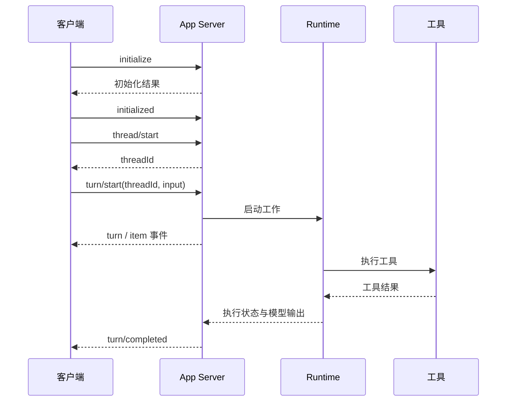

## 3. 统一 Runtime Host 与 App Server 到底先进在哪里？

### 3.1 “全端统一”最有价值的是契约统一

基础设计可能让 CLI、IDE、桌面端各自实现一套循环。新增“审批后继续”时，每端都需要改代码，状态语义容易分叉。

共享运行时的思路是：客户端发送结构化意图，宿主掌管任务与执行，然后把事件流发回客户端。同样的工具开始、工具结束、等待审批、完成、失败，可以用同一套状态语义表示。

App Server 提供双向通信和线程、轮次、条目等协议原语。官方说明它可用于富客户端集成，并支持 CLI 连接远程宿主。**这支持“可复用的宿主接口”，但不证明所有产品只运行一个 OS 进程，或所有线程共享一个 JavaScript 堆。** [官方 App Server 文档](https://learn.chatgpt.com/docs/app-server)

```text
Thread：一段持续对话
  └─ Turn：一次用户请求及随后的一轮工作
       └─ Item：用户消息 / 模型消息 / 工具执行 / 文件变更等
```

注意：不同 SDK 对“turn”的定义不完全一致。不要把 Codex 的产品轮次、一次模型 API response 和循环中的一个 model step 当成同一个对象。

### 3.2 一次请求怎样走完？



协议消息遵循 JSON-RPC 风格，App Server 在线路上省略 `jsonrpc` 字段。请求有 `id`，通知没有 `id`；反向审批请求也有 `id`。因此，不能写成“读到第一行 JSON 就当作当前请求结果”。

```json
{"id":1,"method":"initialize","params":{"clientInfo":{"name":"interview_demo","version":"0.1.0"}}}
```

```json
{"method":"initialized","params":{}}
```

```json
{"id":2,"method":"thread/start","params":{}}
```

```json
{"id":3,"method":"turn/start","params":{"threadId":"实际返回的线程ID","input":[{"type":"text","text":"先解释这个仓库的结构。"}]}}
```

最后两条仅作为协议示意，本次探测没有发送。完整可运行客户端见附录 `app_server_client.py`，它只执行初始化，验证了真实 stdio 握手。

### 3.3 为什么要区分 request ID、thread ID、turn ID、call ID、cell ID？

| ID | 用途 | 错配会出现什么 |
|---|---|---|
| request ID | 对应一次 RPC 请求与响应 | 把审批回复当成启动结果 |
| thread ID | 确定对话与工作区归属 | 跨任务污染上下文或权限 |
| turn ID | 确定当前正在进行的工作 | 新要求误加给已经结束的旧轮次 |
| call ID | 对应某次工具调用和结果 | 工具结果串线、重复提交 |
| cell ID | 定位可挂起/等待的代码执行单元 | 等待或取消了错误的代码单元 |

这些概念相关但不可互换。服务端生成的 ID 应原样传递；业务层额外的 revision 用于记录需求变化，不要拿它冒充协议原有字段。

### 3.4 统一宿主的收益与代价

| 设计 | 收益 | 代价 |
|---|---|---|
| 每个会话独立进程 | 生命周期简单，崩溃隔离自然 | 重复初始化、资源复用难、多端连接需额外设计 |
| 多会话共享宿主 | 工具连接和协议复用，统一观察与管理 | 需要防止状态串线、资源争抢、共享故障 |
| 控制服务与执行沙盒分开 | 计算资源可替换，持久状态独立 | 增加 RPC、重连、租约、版本兼容成本 |

**一个 session 一个进程不是架构原罪。** 对不可信代码来说，较强的隔离有价值。选择 Rust、Bun、Node 或 Python 本身，也不能证明任务调度和状态恢复是否设计得好。

工程上，一个共享宿主至少应有：按线程隔离的权限与状态、全局与每线程并发限制、有界队列、输出背压、取消传播、断线恢复、版本协商。统一实现不等于放弃隔离。

### 3.5 远程连接与版本漂移

官方文档中的 localhost 例子：

```bash
codex app-server --listen ws://127.0.0.1:4500
# 在另一个终端连接同一宿主
codex --remote ws://127.0.0.1:4500
```

“CLI 连接 App Server”和“App Server 连接 Code Mode Host”是两段不同的连接。前者是产品控制协议，后者是代码执行宿主协议。

本次还发现一个真实的文档/源码差异：在线 App Server 文档仍展示 `--code-mode-host wss://...`；固定源码中的 `CodeModeHostTransport::Grpc` 和 URL 校验则接受 `http/https`。因此，本文不提供一个号称跨版本通用的远程 Code Mode 部署命令。应以你实际部署版本生成的 schema、帮助和相应源码为准。远程暴露还要配置认证与传输保护，实验性接口不能自动推定为生产承诺。[固定源码：宿主传输配置](https://github.com/openai/codex/blob/ddea03ad049142943bdbf13e937b1d67e8c1ba0c/codex-rs/app-server/src/code_mode_host.rs)

### 3.6 面试回答

> 我理解统一 Runtime Host 的核心是把 Agent 的执行语义从客户端里抽出来，用稳定的任务协议支撑多个前端。收益是会话、工具、审批和事件的行为一致；代价是共享宿主必须补足隔离、背压、恢复和版本兼容。我不会用进程数量或实现语言直接判断架构优劣。

<a id="gui"></a>
## 4. Agent GUI：看上去是界面，本质上是运行时状态的投影

截图赞扬 UI/UX，但真正值得面试讨论的是“界面如何让用户知道发生了什么，以及还能控制什么”。本节是基于事件式系统的工程设计，不宣称复原闭源桌面端代码。

### 4.1 好用的界面需要哪些底层支持？

| 用户看到的体验 | 底层必需能力 |
|---|---|
| 工具在执行时能看到进度 | 有类型的工具事件、增量输出、稳定 item ID |
| 可以半途追加要求 | 输入通道与生成通道并存，明确追加状态 |
| 可以停止任务 | cancellation token、任务/子进程句柄、最终停止事件 |
| 可以审阅文件修改 | diff 与实际工作区状态对应，标明目标版本 |
| 切走再回来还看得到结果 | 持久状态与补读机制 |
| 审批后继续原任务 | 暂停点持久化、审批请求 ID、权限重新校验 |

不能只靠前端计时器伪造“读取文件中”“即将完成”。否则后台失败后，UI 仍可能显示成功。

### 4.2 为什么需要 reducer？

下面使用**自定义教学事件协议**，不是 Codex 字段。一个 reducer 把事件更新成 UI 状态，让“处理事件”和“画界面”分开：

```javascript
function reduce(state, event) {
  if (event.seq <= state.lastSeq) return state; // 已应用的事件不重放
  const next = {...state, lastSeq: event.seq};
  if (event.kind === "tool.started")
    next.tools = {...state.tools, [event.callId]: {status: "running"}};
  if (event.kind === "tool.completed")
    next.tools = {...state.tools, [event.callId]: {status: "completed", result: event.result}};
  if (event.kind === "steer.accepted") next.pendingUpdate = event.updateId;
  if (event.kind === "steer.applied") next.pendingUpdate = null;
  if (event.kind === "turn.completed") next.status = event.status;
  return next;
}
```

前提是服务端提供有序事件流；若发现序号缺口，应补读或刷新快照，而不是用 `lastSeq` 掩盖缺失。多线程事件还需按 thread/turn 分流。**不要把教学事件序号直接映射成 App Server 每条通知都自带的字段。**

重连可采用“快照 + 快照游标之后的事件”模式，保证快照与游标来自同一个一致性边界。否则，读快照和订阅之间会丢事件。具体产品是否支持事件回放，要查对应协议，不能凭 UI 看起来能恢复就推断实现。

### 4.3 交互上最重要的三个区分

1. **接受请求 ≠ 完成工作**：RPC 返回的是启动确认还是完成结果？
2. **工具完成 ≠ 任务成功**：测试命令退出，不代表退出码为零；退出码为零，也不代表覆盖了验收要求。
3. **新要求入队 ≠ 新要求已应用**：steering 必须呈现实际状态，而不是一按发送就宣称“已经调整”。

<a id="async"></a>
